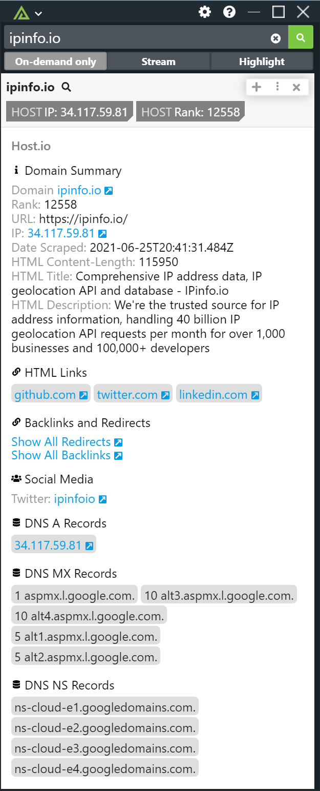

# Polarity host.io Integration

The Polarity host.io integration allows for domain entity types to be enriched against the host.io API. Enabling Analysts to have instant context on a domains IP, backlinks, social sites and more. 

By default the integration is set to on-demand only.

Check out the integration below: 

|  |
|---|
|*Host.io* |

## Host.io Configuration Options 

### API Key 
An API key fro Host.io is required in order to utilize the service. To obtain a free API Key you can sign up below: 

Register for a free account (Max 1000 lookups per month) at the following URL:
https://host.io/signup

## Installation Instructions

Installation instructions for integrations are provided on the [PolarityIO GitHub Page](https://polarityio.github.io/).

## Polarity

Polarity is a memory-augmentation platform that improves and accelerates analyst decision making.  For more information about the Polarity platform please see:

https://polarity.io/
